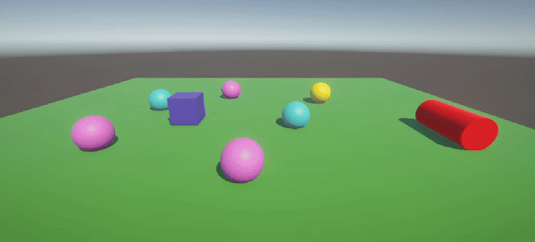

# II-Scripts

## Descripción

En esta escena se han utilizado varios objetos 3D básicos, incluyendo un cubo, una esfera y un cilindro. Los scripts implementados permiten manipular estos objetos de diversas maneras, como cambiar sus posiciones y colores, así como obtener información sobre ellos.

---

## Scripts

### RandomColor.cs

Este script cambia aleatoriamente el color y la posición de un objeto cada 120 frames.

Características principales:
- Cambia el color del objeto cada cierto número de frames.
- Mueve el objeto a una posición aleatoria dentro de un rango específico.

### ObjectName.cs

Este script muestra el nombre del objeto al que está adjunto en la consola al inicio de la escena.

### VectorCalculations.cs

Este script realiza varios cálculos vectoriales y muestra los resultados en la consola de depuración.

Características principales:
- Calcula las magnitudes de dos vectores.
- Calcula el ángulo entre dos vectores.
- Calcula la distancia entre dos vectores.
- Determina qué vector está más alto.

### SpherePosition.cs

Este script muestra la posición de la esfera en la consola.

### SphereDistance.cs

Este script calcula y muestra las distancias del cubo y el cilindro respecto a la esfera.

### ObjectPositioner.cs

Este script permite mover los objetos (cubo, esfera y cilindro) a nuevas posiciones cuando se presiona la tecla espacio.

Características principales:
- Encuentra los objetos por sus etiquetas al inicio.
- Guarda las posiciones originales de los objetos.
- Mueve los objetos cuando se presiona la tecla espacio.

### ColorChanger.cs

Este script permite cambiar los colores del cilindro y el cubo usando teclas específicas.

Características principales:
- Cambia el color del cilindro al presionar la tecla 'C'.
- Cambia el color del cubo al presionar la tecla de flecha hacia arriba.
- Genera colores aleatorios para los objetos.

### SphereManager.cs

Este script gestiona un grupo de esferas, interactuando con ellas basándose en su distancia al cubo.

Características principales:
- Eleva continuamente la esfera más cercana al cubo.
- Cambia el color de la esfera más lejana al presionar la tecla espacio.

---

## Autor

Álvaro Fontenla León